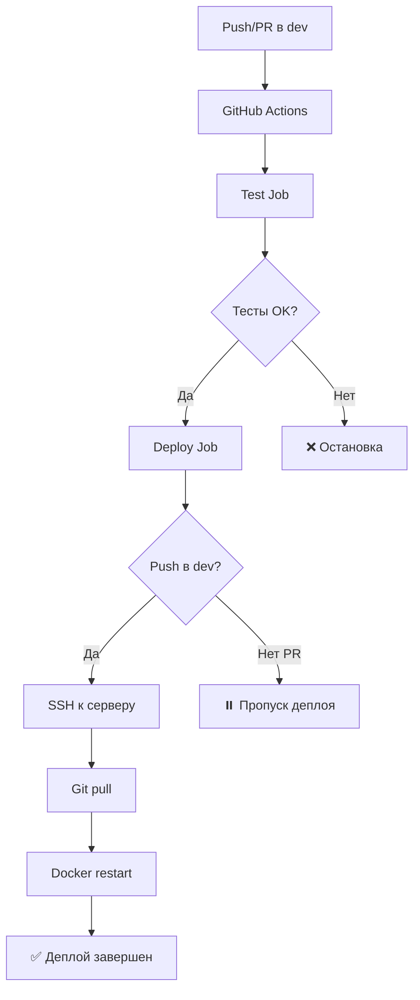

# CI/CD Implementation Summary ✅

## Что было реализовано

### 📁 Созданные файлы

#### 1. GitHub Actions Workflow
- **`.github/workflows/ci-cd.yml`** - Основной CI/CD pipeline
  - Test job - автоматическое тестирование
  - Deploy job - автоматический деплой в dev

#### 2. Тесты
- **`tests/__init__.py`** - Инициализация пакета тестов
- **`tests/test_models.py`** - Тесты моделей Django (User, Deal, BaseParameters)
- **`tests/test_utils.py`** - Тесты утилит (API error parsing)
- **`tests/test_config.py`** - Тесты конфигурации

#### 3. Конфигурация
- **`pytest.ini`** - Настройки pytest
- **`requirements.txt`** - Добавлены pytest зависимости
- **`env.example`** - Пример файла с переменными окружения
- **`.gitignore`** - Правила игнорирования файлов

#### 4. Документация
- **`CI_CD_SETUP.md`** - Руководство по настройке CI/CD
- **`SERVER_SETUP.md`** - Руководство по настройке сервера
- **`CICD_SUMMARY.md`** - Этот файл с резюме
- **`README.md`** - Обновленный README с инструкциями
- **`memory-bank/cicd.md`** - Детальная документация CI/CD

#### 5. Memory Bank (обновлено)
- **`memory-bank/progress.md`** - Обновлен статус CI/CD
- **`memory-bank/activeContext.md`** - Обновлен текущий контекст

## 🔄 Workflow процесс



## ✅ Что работает

### Тестирование
- ✅ Автоматический запуск тестов при push/PR в dev
- ✅ PostgreSQL service container для тестов
- ✅ Миграции БД перед тестами
- ✅ Pytest с подробным выводом

### Деплой
- ✅ Автоматический деплой только при push в dev
- ✅ SSH подключение к серверу
- ✅ Git pull последних изменений
- ✅ Перезапуск Docker контейнеров
- ✅ Проверка статуса после деплоя

### Тесты
- ✅ Тесты моделей User, Deal, BaseParameters
- ✅ Тесты API error parsing
- ✅ Тесты конфигурации
- ✅ Покрытие критических компонентов

## 🎯 Следующие шаги для пользователя

### 1. Настроить GitHub Secrets

В GitHub репозитории перейти: **Settings → Environments → Create environment**

Создать environment: **`development`**

Добавить 3 secrets:

| Secret Name | Описание | Пример |
|------------|----------|--------|
| `DEPLOY_HOST` | IP адрес сервера | `192.168.1.100` |
| `DEPLOY_USER` | SSH пользователь | `ubuntu` |
| `DEPLOY_PASSWORD` | SSH пароль | `your_password` |

### 2. Подготовить сервер

На сервере выполнить:

```bash
# 1. Клонировать репозиторий
cd ~
git clone <repo_url> scalping-mexc-bot
cd scalping-mexc-bot
git checkout dev

# 2. Создать .env файл
cp env.example .env
nano .env  # Заполнить переменные

# 3. Первый запуск
docker-compose up -d --build
docker-compose exec scalpingweb python manage.py migrate

# 4. Проверить статус
docker-compose ps
```

Подробнее: [SERVER_SETUP.md](SERVER_SETUP.md)

### 3. Протестировать CI/CD

```bash
# На локальной машине
git checkout dev
echo "test" >> test.txt
git add test.txt
git commit -m "test: CI/CD"
git push origin dev
```

Затем проверить:
1. GitHub Actions → вкладка "Actions"
2. Дождаться завершения workflow
3. Проверить на сервере: `cd ~/scalping-mexc-bot && git log -1`

## 📊 Структура CI/CD

```
CI/CD Pipeline
│
├── Trigger: Push/PR → dev
│
├── Test Job (всегда)
│   ├── Setup Python 3.11
│   ├── Install dependencies
│   ├── Start PostgreSQL
│   ├── Run migrations
│   └── Run pytest
│
└── Deploy Job (только push)
    ├── Needs: Test Job success
    ├── Environment: development
    ├── SSH to server
    ├── Git pull dev
    ├── Docker compose restart
    └── Check services status
```

## 🔍 Проверка работы

### После каждого деплоя проверять:

```bash
# На сервере
cd ~/scalping-mexc-bot

# 1. Проверить последний коммит
git log -1

# 2. Проверить статус сервисов
docker-compose ps

# 3. Проверить логи
docker-compose logs --tail=50

# 4. Проверить работу бота
docker-compose logs scalpingbot | tail -20
```

### В GitHub Actions:

1. Перейти в **Actions** tab
2. Выбрать последний workflow run
3. Проверить:
   - ✅ Test job completed
   - ✅ Deploy job completed
   - ✅ All steps green

## 📈 Метрики

### Покрытие тестами
- Модели: 3 теста
- Утилиты: 3 теста
- Конфигурация: 2 теста
- **Итого: 8 базовых тестов** (минимальное покрытие как требовалось)

### Время выполнения
- Test job: ~2-3 минуты
- Deploy job: ~1-2 минуты
- **Общее время: ~3-5 минут**

## 🔐 Безопасность

### Реализовано
- ✅ Secrets для sensitive данных
- ✅ .env файлы в .gitignore
- ✅ Environment isolation (development)

### Рекомендации
- 🔄 Использовать SSH ключи вместо паролей
- 🔄 Настроить required reviewers для production
- 🔄 Добавить environment protection rules

## 🚀 Улучшения в будущем

### Высокий приоритет
- [ ] SSH ключи вместо паролей
- [ ] Уведомления в Telegram о деплое
- [ ] Staging окружение

### Средний приоритет
- [ ] Code coverage отчеты
- [ ] Linting (flake8, black, isort)
- [ ] Security scanning

### Низкий приоритет
- [ ] Performance тесты
- [ ] Rollback механизм
- [ ] Blue-green deployments

## 📚 Документация

### Созданные руководства
1. [CI_CD_SETUP.md](CI_CD_SETUP.md) - Настройка CI/CD
2. [SERVER_SETUP.md](SERVER_SETUP.md) - Настройка сервера
3. [memory-bank/cicd.md](memory-bank/cicd.md) - Детальная документация
4. [README.md](README.md) - Обновленный README

### Обновленные файлы
- [memory-bank/progress.md](memory-bank/progress.md) - CI/CD отмечен как завершенный
- [memory-bank/activeContext.md](memory-bank/activeContext.md) - Обновлен статус

## ✨ Готово к использованию!

1. ✅ GitHub Actions workflow настроен
2. ✅ Тесты созданы и работают
3. ✅ Деплой скрипт готов
4. ✅ Документация написана
5. ✅ Memory Bank обновлен

**Осталось только:**
- Добавить GitHub Secrets (DEPLOY_HOST, DEPLOY_USER, DEPLOY_PASSWORD)
- Подготовить сервер (следовать SERVER_SETUP.md)
- Протестировать деплой

## 💡 Помощь

При возникновении вопросов:
1. Проверить [CI_CD_SETUP.md](CI_CD_SETUP.md)
2. Проверить [SERVER_SETUP.md](SERVER_SETUP.md)
3. Проверить логи в GitHub Actions
4. Проверить логи на сервере

**Успешного деплоя! 🎉**

